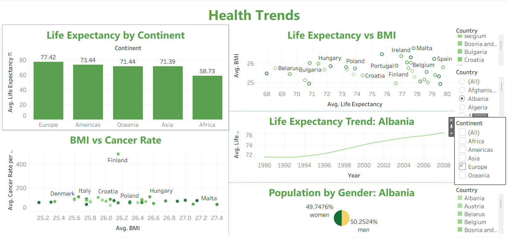
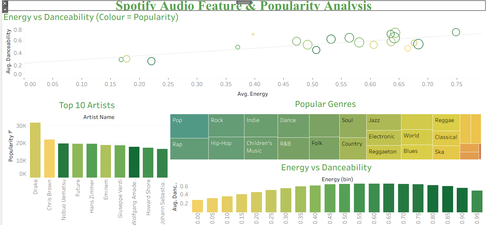

# Tableau Retail & Sales Dashboard Project

This project was completed as part of a **Data Technician Bootcamp** and focuses on analysing datasets using **Tableau** to create interactive dashboards and visualisations.

The goal of the project was to explore different datasets and build dashboards that communicate insights clearly through **data storytelling and visual analytics**. The dashboards allow users to explore trends, patterns, and relationships within the data using interactive filters and visualisations.

---

# Project Overview

This repository contains two Tableau dashboards created using different datasets:

1. **Health Dataset Dashboard**
2. **Spotify Audio Features Dashboard**

Each dashboard demonstrates how Tableau can be used to transform raw datasets into clear and interactive visual insights.

---

# Tableau Skills Demonstrated

This project demonstrates several key Tableau skills including:

- Creating **interactive dashboards**
- Building multiple chart types including:
  - Bar charts
  - Line charts
  - Scatter plots
  - Pie charts
  - Treemaps
- Using **filters and slicers** to allow users to explore data dynamically
- Creating **calculated fields**
- Designing dashboards that support **clear data storytelling**
- Combining multiple visualisations into a single dashboard

---

# Dashboard Visualisations

## Health Trends Dashboard


[Link to My Report](https://public.tableau.com/views/HealthTrends_17707471254250/GlobalHealthDashboard?:language=en-GB&:sid=&:redirect=auth&:display_count=n&:origin=viz_share_link)

This dashboard explores global **health indicators** such as life expectancy, BMI, cancer rates, and population distribution. The visualisations allow users to compare health trends across continents and countries.

Key insights include:

- Average **life expectancy by continent**
- Relationship between **BMI and life expectancy**
- Comparison of **BMI and cancer rates**
- **Life expectancy trends over time**
- **Population distribution by gender**

Interactive filters allow users to explore health data by **country and continent** to identify patterns and trends.

---

## Spotify Audio Features & Popularity Dashboard


[Link to My Report](https://public.tableau.com/views/Spotify_17709891742030/Dashboard1?:language=en-GB&:sid=&:redirect=auth&:display_count=n&:origin=viz_share_link)

This dashboard analyses **Spotify music data** to explore relationships between audio features and artist popularity.

The dashboard includes visualisations showing:

- Relationship between **energy and danceability**
- **Top 10 artists by popularity**
- Distribution of **popular music genres**
- Patterns between **energy levels and track characteristics**

These visualisations help highlight how audio features relate to music popularity and genre distribution.

---

# Dataset

The datasets used in this project include:

- **Health dataset** containing global health indicators such as life expectancy, BMI, and cancer rates.
- **Spotify dataset** containing audio features, popularity metrics, and genre information for music tracks.

---

# Tools Used

- **Tableau** – dashboard creation and data visualisation
- **Microsoft Excel** – dataset preparation

---

# Repository Structure

```
My-Tableau-Repository
│
├── Data_Technician_Workbook_Week_2_2026.docx
├── EMSI_JobChange_UK.xlsx
├── Heath-Dashboard.png
├── Spotify-Dashboard.png
└── README.md
```

---

# Learning Outcomes

Through this project I developed practical skills in:

- Creating **interactive dashboards in Tableau**
- Visualising complex datasets
- Applying **filters and calculated fields** to explore data
- Communicating insights through **data storytelling**
- Designing dashboards that are clear and easy to interpret
